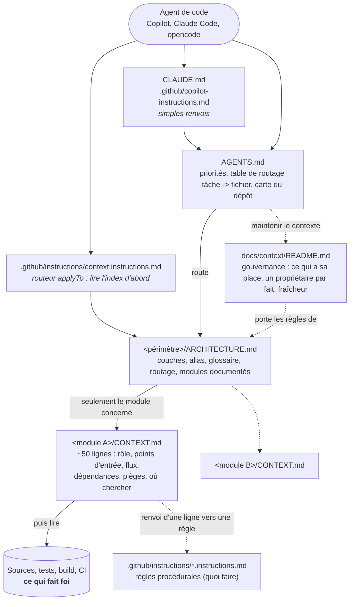
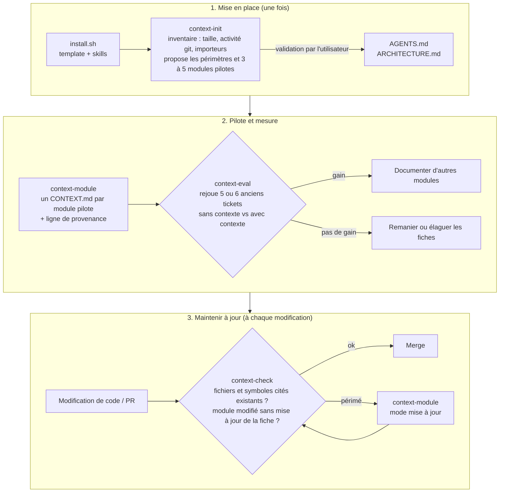

# context-kit

[English](README.md) | Français

Un template à ajouter à n'importe quel dépôt existant pour que les agents de code (GitHub Copilot,
Claude Code, opencode...) et les développeurs disposent d'un **contexte court, routé et vérifié**,
au lieu de lancer des recherches à l'aveugle dans une grosse base de code.

Le kit installe une méthode de documentation, pas un générateur de documentation : un point d'entrée,
des index d'architecture, une petite fiche par module clé, des règles de gouvernance, un contrôle de
fraîcheur et un banc d'évaluation pour prouver que le contexte aide réellement.

## Ce qui est installé dans un dépôt

Un agent entre toujours par `AGENTS.md`, suit une seule route, et ne lit que la fiche du module sur
lequel il travaille, puis le code.



## Cycle de vie

Les quatre skills installent, rédigent, maintiennent à jour et mesurent le contexte.



Principes (portés par [`template/docs/context/README.md`](template/docs/context/README.md) une fois installé) :

- **Une boussole, pas une encyclopédie.** Des fichiers courts, lus à la demande via une table de routage.
- **Descriptif ou procédural.** Les faits (« comment ça marche ») vont dans `CONTEXT.md` ; les règles
  (« quoi faire ») vont dans `.github/instructions/`. Un seul propriétaire par fait : on renvoie au
  lieu de recopier.
- **Le code fait foi.** Quand la prose contredit le code, les tests ou la CI, c'est la prose qui est
  fausse.
- **La fraîcheur se vérifie, elle ne s'espère pas.** Une ligne de provenance par fiche, et un script
  qui vérifie que chaque fichier et symbole cité existe encore.
- **Mesurer avant de généraliser.** Rejouer d'anciens tickets avec et sans contexte.

## Contenu

| Chemin | Rôle |
|---|---|
| [`template/`](template/) | Fichiers appartenant au projet, copiés dans le dépôt cible (jamais écrasés sans `--force`) |
| [`skills/context-init`](skills/context-init/SKILL.md) | Inventorie le code, propose les périmètres et les modules pilotes, écrit `AGENTS.md` et `ARCHITECTURE.md` |
| [`skills/context-module`](skills/context-module/SKILL.md) | Écrit ou met à jour un `CONTEXT.md` à partir du code, des tests et de l'historique git |
| [`skills/context-check`](skills/context-check/SKILL.md) | Lance `check_context.py` : fichiers, symboles, alias et liens cités, provenance, taille, modules modifiés |
| [`skills/context-eval`](skills/context-eval/SKILL.md) | Lance `context_eval.py` : rejoue d'anciens tickets pour chaque variante de contexte et note les diffs |
| [`install.sh`](install.sh) | Installe le kit dans un dépôt |
| [`tests/`](tests/) | Tests des deux scripts |

Les skills suivent le format [Agent Skills](https://agentskills.io) (`SKILL.md` avec frontmatter) : les
mêmes fichiers fonctionnent avec [Copilot](https://docs.github.com/en/copilot/concepts/agents/about-agent-skills),
Claude Code et opencode. Les scripts n'ont besoin que de Python 3 et git (PyYAML est optionnel, pour
écrire les tâches d'évaluation en YAML).

Le contenu des modèles et des skills est rédigé en anglais.

## Utilisation

```bash
git clone https://github.com/tomsoulage-dedalus/context-kit
./context-kit/install.sh --with-evals /chemin/vers/mon-depot                    # Copilot : .github/skills
./context-kit/install.sh --skills-dir .claude/skills /chemin/vers/mon-depot     # Claude Code
```

Ensuite, dans le dépôt cible, avec votre agent :

1. `context-init` : valider les périmètres et les 3 à 5 modules pilotes proposés ; le skill écrit les index.
2. `context-module <chemin>` : une fiche par module pilote (le skill demande validation avant d'écrire).
3. `context-check` : corriger les erreurs ; l'ajouter à la CI avec `--changed-since origin/<base>`.
4. `context-eval` : transformer 5 ou 6 PR mergées en tâches et comparer `no-context` et `context`.

Relancer `install.sh` met à jour les skills sans toucher aux fichiers du projet.

## Développement

```bash
python3 -m unittest discover -s tests -v
```

## Inspirations

| Source | Ce qui a été repris |
|---|---|
| [`dedalus-cis4u/cto-orbisu-scaffolder`](https://github.com/dedalus-cis4u/cto-orbisu-scaffolder) (interne Dedalus), revu au commit `184b987` | `AGENTS.md` comme point d'entrée unique avec une table de routage « tâche -> fichier à lire » ; fichiers propres à chaque assistant et instructions `applyTo` réduits à des renvois ; gouvernance du contexte (ce qui a sa place, élagage, un propriétaire par fait, le code exécutable fait foi) ; format de tâches `context-evals` (chemins autorisés et requis, motifs requis et interdits, commandes) et variantes comparables qui ne diffèrent que par le contexte |
| [How Meta used AI to map tribal knowledge in large-scale data pipelines](https://engineering.fb.com/2026/04/06/developer-tools/how-meta-used-ai-to-map-tribal-knowledge-in-large-scale-data-pipelines/) (Meta Engineering, 2026) | « Une boussole, pas une encyclopédie » : des fichiers de contexte courts par module, chargés quand ils sont pertinents, qui ont réduit d'environ 40 % les appels d'outils par tâche ; validation automatique de leur fraîcheur |
| [Evaluating AGENTS.md: Are Repository-Level Context Files Helpful for Coding Agents?](https://arxiv.org/abs/2602.11988) (Gloaguen et al., ETH Zurich, 2026) | Plus de contexte n'est pas mieux : les vues d'ensemble génériques augmentent le coût de plus de 20 % sans améliorer le taux de réussite. D'où un contenu court et non déductible du code, du routage plutôt que du texte toujours chargé, et une étape d'évaluation obligatoire |
| [AGENTS.md](https://agents.md) | Convention ouverte pour le point d'entrée des agents |
| [Agent Skills](https://agentskills.io) | Format portable utilisé par les quatre skills |
| [Instructions de dépôt GitHub Copilot](https://docs.github.com/en/copilot/how-tos/configure-custom-instructions/add-repository-instructions) | `.github/copilot-instructions.md` et instructions par chemin `.github/instructions/*.instructions.md` avec `applyTo` |
| Pilote interne sur `orme-prescription` (`frontend/prescription-lib`) | Organisation `ARCHITECTURE.md` + `CONTEXT.md` par module et ses six sections, limite d'environ 50 lignes, ni numéros de ligne ni signatures, ligne de provenance, et protocole « mesurer sur des tickets historiques » |

## Feuille de route

Hors de cette version, à décider :

- D'autres méthodes de documentation au-dessus de la couche de contexte : [Diátaxis](https://diataxis.fr)
  pour la documentation destinée aux humains, diagrammes [C4 model](https://c4model.com) en Mermaid,
  [ADR](https://adr.github.io) pour les décisions.
- Régénération incrémentale des fiches en CI, à partir du `git diff` depuis leur commit de provenance.
- Langue par défaut du contenu généré (anglais aujourd'hui).
- Installation distante en une ligne.
