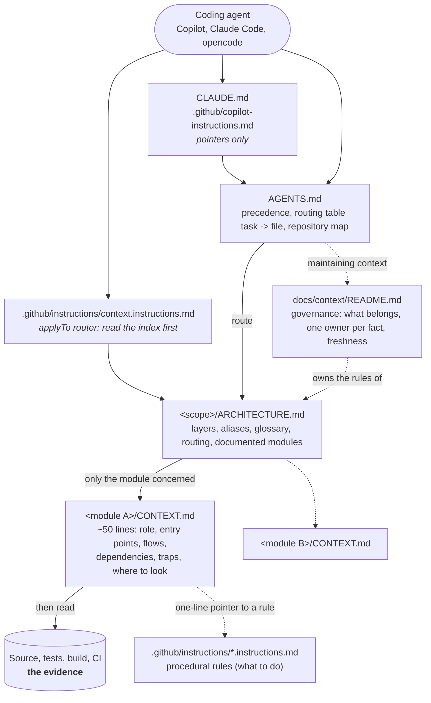
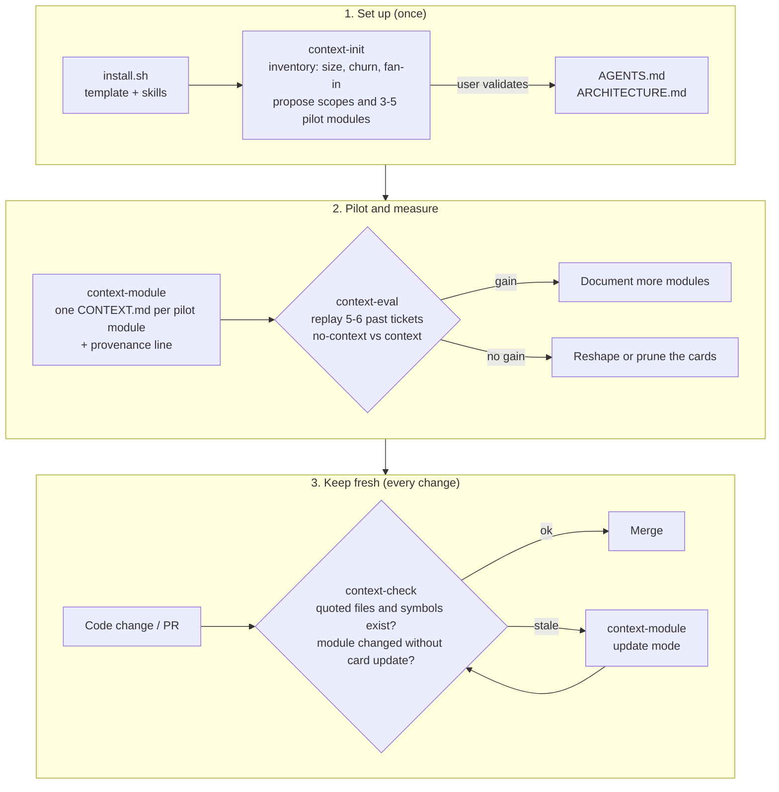

# context-kit

English | [Français](README.fr.md)

A template to add to any existing repository so that coding agents (GitHub Copilot, Claude Code,
opencode...) and developers get **short, routed, verified context** instead of grepping a large
codebase blindly.

It installs a documentation method, not a documentation generator: an entry point, architecture
indexes, one small card per key module, governance rules, a freshness check, and an evaluation bench
to prove the context helps.

## What gets installed in a repository

An agent always enters through `AGENTS.md`, follows one route, and reads only the card of the module
it works on, then the code.



## Lifecycle

The four skills install, write, keep fresh, and measure the context.



Principles (owned by [`template/docs/context/README.md`](template/docs/context/README.md) once installed):

- **A compass, not an encyclopedia.** Small files, read on demand through a routing table.
- **Descriptive vs procedural.** Facts ("how it works") live in `CONTEXT.md`; rules ("what to do")
  live in `.github/instructions/`. One owner per fact; link instead of restating.
- **The code is the evidence.** When prose contradicts code, tests, or CI, the prose is wrong.
- **Freshness is checked, not hoped for.** Provenance line per card, and a script that verifies that
  every quoted file and symbol still exists.
- **Measure before generalizing.** Replay historical tickets with and without context.

## Contents

| Path | Role |
|---|---|
| [`template/`](template/) | Project-owned files copied into the target repository (never overwritten without `--force`) |
| [`skills/context-init`](skills/context-init/SKILL.md) | Inventories the code, proposes scopes and pilot modules, writes `AGENTS.md` and `ARCHITECTURE.md` |
| [`skills/context-module`](skills/context-module/SKILL.md) | Writes or updates one `CONTEXT.md` from code, tests and git history |
| [`skills/context-check`](skills/context-check/SKILL.md) | Runs `check_context.py`: quoted files, symbols, aliases, links, provenance, budget, changed modules |
| [`skills/context-eval`](skills/context-eval/SKILL.md) | Runs `context_eval.py`: replays past tickets per context variant and grades diffs |
| [`install.sh`](install.sh) | Installs the kit into a repository |
| [`tests/`](tests/) | Tests of both scripts |

Skills follow the [Agent Skills](https://agentskills.io) format (`SKILL.md` with frontmatter), so the
same files work with [Copilot](https://docs.github.com/en/copilot/concepts/agents/about-agent-skills),
Claude Code and opencode. Scripts need only Python 3 and git (PyYAML optional for YAML eval tasks).

## Usage

```bash
git clone https://github.com/tomsoulage-dedalus/context-kit
./context-kit/install.sh --with-evals /path/to/my-repo                       # Copilot: .github/skills
./context-kit/install.sh --skills-dir .claude/skills /path/to/my-repo        # Claude Code
```

Then, in the target repository with your agent:

1. `context-init`: validate the proposed scopes and 3 to 5 pilot modules; it writes the indexes.
2. `context-module <path>`: one card per pilot module (the skill asks before writing).
3. `context-check`: fix errors; add it to CI with `--changed-since origin/<base>`.
4. `context-eval`: turn 5 or 6 merged PRs into tasks and compare `no-context` and `context`.

Re-running `install.sh` updates the skills and leaves project files untouched.

## Development

```bash
python3 -m unittest discover -s tests -v
```

## Inspirations

| Source | What was taken |
|---|---|
| [`dedalus-cis4u/cto-orbisu-scaffolder`](https://github.com/dedalus-cis4u/cto-orbisu-scaffolder) (Dedalus internal), reviewed at `184b987` | `AGENTS.md` as the single entry point with a "task -> read" routing table; assistant-specific files and `applyTo` instructions reduced to pointers; context governance (what belongs, pruning, one owner per fact, executable artifacts as evidence); the `context-evals` task format (allowed and required paths, required and forbidden patterns, commands) and comparable variants that differ only by context |
| [How Meta used AI to map tribal knowledge in large-scale data pipelines](https://engineering.fb.com/2026/04/06/developer-tools/how-meta-used-ai-to-map-tribal-knowledge-in-large-scale-data-pipelines/) (Meta Engineering, 2026) | "Compass, not encyclopedia": short module-level context files loaded when relevant, which reduced tool calls per task by about 40%; automated freshness validation of those files |
| [Evaluating AGENTS.md: Are Repository-Level Context Files Helpful for Coding Agents?](https://arxiv.org/abs/2602.11988) (Gloaguen et al., ETH Zurich, 2026) | More context is not better: generic overviews raised cost by over 20% without improving success. Hence small non-inferable content, routing instead of always-loaded text, and a mandatory evaluation step |
| [AGENTS.md](https://agents.md) | Open convention for the agent entry point |
| [Agent Skills](https://agentskills.io) | Portable skill format used by the four skills |
| [GitHub Copilot repository instructions](https://docs.github.com/en/copilot/how-tos/configure-custom-instructions/add-repository-instructions) | `.github/copilot-instructions.md` and path-scoped `.github/instructions/*.instructions.md` with `applyTo` |
| Internal pilot on `orme-prescription` (`frontend/prescription-lib`) | `ARCHITECTURE.md` + per-module `CONTEXT.md` layout and its six sections, the ~50-line budget, no line numbers or signatures, provenance line, and the "measure on historical tickets" protocol |

## Roadmap

Not in this version, to be decided:

- Additional documentation methods on top of the context layer: [Diátaxis](https://diataxis.fr)
  for human docs, [C4 model](https://c4model.com) diagrams in Mermaid, [ADR](https://adr.github.io)
  for decisions.
- Incremental regeneration of cards from `git diff` since their provenance commit, in CI.
- Default language of generated content (English today).
- One-line remote install.
